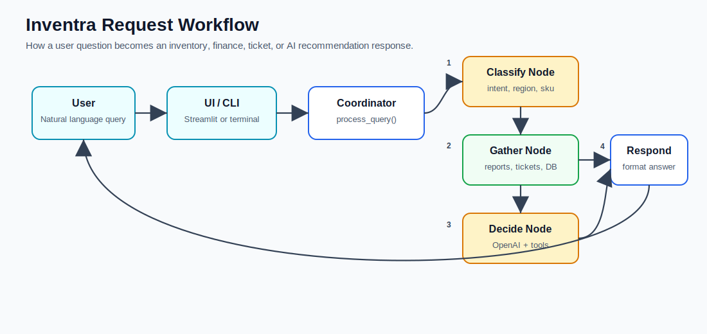
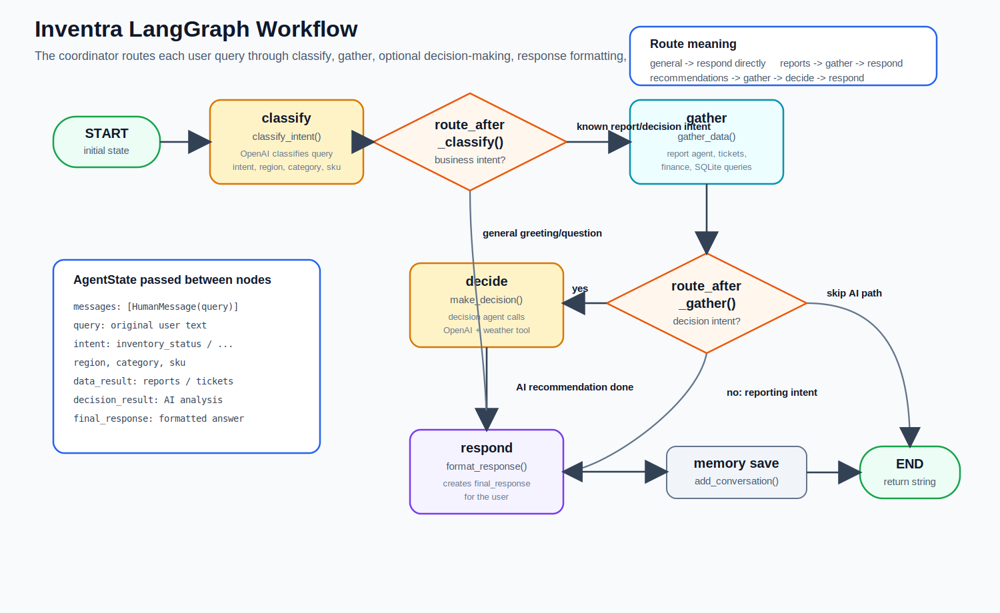
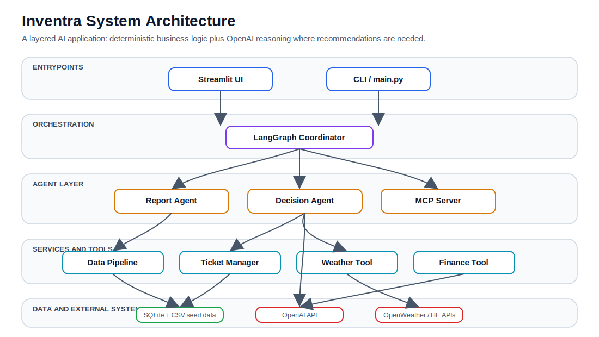

# Inventra - AI-Powered Inventory & Financial Management System

**An intelligent multi-agent system for inventory management, financial analysis, and business decision-making using LangGraph, OpenAI, and weather forecasting.**

---

## Table of Contents

- [Project At A Glance](#project-at-a-glance)
- [Architecture](#architecture)
- [Project Structure](#project-structure)
- [Sample Queries](#sample-queries)
- [Contributing](#contributing)

---

## Project At A Glance

Inventra helps inventory and finance teams ask natural-language questions, inspect stock and sales data, get weather-aware reorder recommendations, and manage restocking tickets from one Streamlit dashboard.







---


### Core Capabilities
- **Multi-Agent AI System**: Orchestrated using LangGraph for complex decision-making
- **Financial Analysis**: Automated financial summaries, profit/loss tracking, revenue analysis
- **Inventory Management**: Real-time stock tracking, low-stock alerts, reorder recommendations
- **Weather Integration**: Weather-based demand forecasting and inventory planning
- **Ticket Management**: Automated vendor ticketing for restocking and issues
- **Interactive Dashboard**: Streamlit-based web interface for visualization
- **Conversation Memory**: Maintains context across interactions
<!-- - **Export Capabilities**: Export reports to CSV, JSON, Excel -->

### AI Agents
1. **Coordinator Agent** (LangGraph): Orchestrates workflow between agents
2. **Decision Agent**: Makes inventory and financial recommendations
3. **Report Agent**: Generates data reports and summaries

---

## Architecture

### Simplified Multi-Agent Workflow (4-Node LangGraph)

```
┌─────────────────────────────────────────────────────────────┐
│                     User Interface                          │
│              (Streamlit Web App / CLI)                      │
└────────────────────┬────────────────────────────────────────┘
                     │
        ┌────────────▼────────────┐
        │   1. CLASSIFY Intent    │
        │   (LLM Classification)  │
        └────────────┬────────────┘
                     │
        ┌────────────▼────────────┐
        │   2. GATHER Data        │
        │   (Report Agent)        │
        └────────────┬────────────┘
                     │
        ┌────────────▼────────────┐
        │   3. DECIDE (Optional)  │
        │   (Decision Agent + AI) │
        └────────────┬────────────┘
                     │
        ┌────────────▼────────────┐
        │   4. RESPOND Format     │
        │   (User-friendly text)  │
        └─────────────────────────┘
```

### Component Architecture

```
┌─────────────────────────────────────────────────────────────┐
│              Coordinator (LangGraph - 341 lines)            │
│   Classify → Gather → Decide → Respond                     │
└─────┬──────────────────────────────┬─────────────────┬──────┘
      │                              │                 │
┌─────▼─────────┐      ┌─────────────▼──────┐  ┌──────▼──────┐
│ Decision Agent│      │   Report Agent     │  │ Data Pipeline│
│ (OpenAI LLM)  │      │  (Data Analysis)   │  │ (Processing) │
│ - Reorder Rec │      │  - Inventory       │  │ - Aggregates│
│ - Vendor Sel  │      │  - Financial       │  │ - Caching   │
│ - Weather Fcs │      │  - Sales           │  │             │
│ + MCP Tools   │      │  - Tickets         │  │             │
└─────┬─────────┘      └─────────────┬──────┘  └──────┬──────┘
      │                              │                 │
┌─────▼──────────────────────────────▼─────────────────▼──────┐
│                   Services & Tools Layer                     │
│  ┌──────────┐  ┌──────────┐  ┌─────────────┐               │
│  │ Finance  │  │ Weather  │  │   Tickets   │               │
│  │  Tool    │  │   Tool   │  │   Manager   │               │
│  └──────────┘  └──────────┘  └─────────────┘               │
└──────────────────────────┬───────────────────────────────────┘
                           │
┌──────────────────────────▼───────────────────────────────────┐
│                    Database Layer                            │
│  ┌──────────────┐  ┌──────────────┐  ┌──────────────┐      │
│  │   SQLite     │  │   Memory     │  │     CSV      │      │
│  │  (inventra.db)│  │  (Conversations)│ │  (Seed Data) │      │
│  └──────────────┘  └──────────────┘  └──────────────┘      │
└──────────────────────────────────────────────────────────────┘
```

---

### Database

The system uses SQLite database located at `database/inventra.db`. It includes:
- **Inventory**: Product stock levels and details
- **Sales**: Historical sales transactions
- **Finance**: Financial transactions (sales, purchases)
- **Vendors**: Vendor information
- **Tickets**: Reorder and issue tickets
- **Forecasts**: Weather-based demand forecasts

---

## Project Structure

```
inventra/
├── agents/                    # AI Agents (LLM-powered)
│   ├── coordinator.py         # LangGraph orchestrator
│   ├── decision_agent.py      # Business decision making
│   └── report_agent.py        # Data aggregation & reports
│
├── services/                  # Business Logic & Workflows
│   ├── data_pipeline.py       # Data aggregation
│   ├── forecast_updater.py    # Weather-based forecasting
│   └── ticket_manager.py      # Ticket lifecycle management
│
├── tools/                     # Utility Functions
│   ├── finance.py             # Financial calculations
│   ├── weather.py             # Weather API integration
│   └── export.py              # Data export utilities
│
├── database/                  # Data Persistence Layer
│   ├── db_manager.py          # SQLite operations
│   ├── memory_manager.py      # Conversation history
│   ├── seed_db.py             # Database initialization
│   ├── inventra.db            # SQLite database
│   ├── schema.sql             # Database schema
│   └── data/                  # CSV seed files
│
├── integrations/              # External Integrations
│   └── mcp_tools.py           # MCP protocol tools
│
├── config/                    # Configuration
│   ├── settings.py            # Environment settings
│   └── logger.py              # Logging configuration
│
├── ui/                        # User Interface
│   └── streamlit_app.py       # Streamlit web app
│
├── main.py                    # Application entry point
├── requirements.txt           # Python dependencies
├── .env.example               # Environment template
└── README.md                  # This file
```

---

## Sample Queries

### Financial Analysis
```
- "Show me the financial summary"
- "What's our profit margin?"
- "Give me sales breakdown by region"
- "Show revenue trends"
```

### Inventory Management
```
- "What items are low in stock?"
- "Check inventory for North region"
- "Which products need reordering?"
- "Show me all electronics inventory"
```

### Business Decisions
```
- "Give me reorder recommendations"
- "What should I stock for monsoon season?"
- "Suggest vendors for restocking"
- "Analyze sales opportunities"
```

### Tickets
```
- "Show pending tickets"
- "What tickets need attention?"
- "List all vendor tickets"
```

---

## Contributing

This is an educational and portfolio project. Feel free to:
- Report issues
- Suggest improvements
- Fork and extend functionality

---